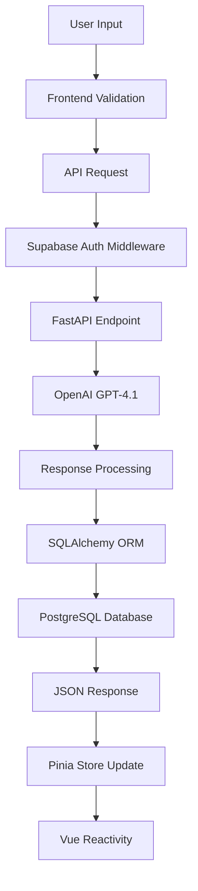

# 🩺 IsThisNormal - Pediatric Medical Consultation App

> An intelligent web application that connects parents to a specialized pediatric medical assistant, providing fast and reliable answers about children's health.


## 📋 Table of Contents

- [About the Project](#-about-the-project)
- [Features](#-features)
- [Tech Stack](#-tech-stack)
- [Architecture](#-architecture)
- [Installation](#-installation)
- [Usage](#-usage)
- [API Reference](#-api-reference)
- [Screenshots](#-screenshots)
- [Contributing](#-contributing)
- [License](#-license)

## 🎯 About the Project

**IsThisNormal** is a modern web application designed to help parents and caregivers get reliable medical guidance about child health issues. The application uses specialized artificial intelligence in pediatrics to provide accurate answers and determine when in-person medical consultation is necessary.

### 🎨 Design Principles

- **User-Centric**: Intuitive interface focused on user experience
- **Medical Safety**: Automatic triage system for urgent cases
- **Responsive Design**: Fully responsive across all devices
- **Performance First**: Fast loading and optimized performance

## ✨ Features

### 🔐 Authentication & Security
- Secure authentication system with **Supabase Auth**
- Session management with httpOnly cookies
- Route protection and authentication middleware
- Real-time data validation

### 🤖 Intelligent Consultations
- **Specialized AI Assistant**: Virtual pediatrician with decades of experience
- **Automatic Triage**: Automatically determines if in-person consultation is needed
- **Structured Responses**: JSON format with medical response + recommendation
- **Complete History**: Storage of all consultations and exchanges

### 💬 Chat Interface
- **Real-Time Chat**: ChatGPT-like interface for consultations
- **Follow-up Questions**: Ability to ask additional questions
- **Loading States**: Visual feedback during processing
- **Contextual Examples**: Common question suggestions

### 📊 Consultation Management
- **Dynamic Sidebar**: Organized history of all consultations
- **Intuitive Navigation**: Easy access to previous consultations
- **Timestamps**: Temporal control of consultations
- **Quick Search**: Efficient location of past consultations

## 🛠 Tech Stack

### Frontend
```typescript
// Core Technologies
- Nuxt.js 3.17.6          // Full-stack Vue.js framework
- Vue.js 3.5.17           // Reactive framework
- TypeScript              // Static typing
- Tailwind CSS 4.1.11     // Utility-first styling
- Pinia 3.0.3             // State management
- VueUse                  // Utility composables
```

### Backend
```python
# API & Services
- FastAPI                 # Async web framework
- SQLAlchemy             # PostgreSQL ORM
- OpenAI GPT-4.1         # Artificial Intelligence
- Supabase Auth          # Authentication & authorization
- PostgreSQL             # Relational database
- Pydantic               # Data validation
```

### Infrastructure & Tools
- **Supabase**: Backend-as-a-Service for auth and database
- **Vite**: Build tool and dev server
- **ESLint + Prettier**: Code quality and formatting
- **Git**: Version control
- **Docker Ready**: Containerization prepared

## 🏗 Architecture

### Project Structure
```
IsThisNormal/
├── backend/                 # FastAPI API
│   ├── routes/             # API endpoints
│   ├── models.py           # SQLAlchemy models
│   ├── services.py         # Business logic + AI
│   ├── auth.py             # Authentication
│   └── database.py         # DB configuration
│
├── isthisnormal/           # Nuxt.js Frontend
│   ├── components/         # Vue components
│   ├── pages/              # Application routes
│   ├── stores/             # Pinia stores
│   ├── composables/        # Reusable composables
│   └── types/              # TypeScript definitions
│
└── README.md               # Documentation
```

### Data Flow


### Data Models
```typescript
// Consultation Model
interface Consultation {
  id: string
  question_text: string
  user_id: string
  created_at: string
  exchanges: Exchange[]
}

// Exchange Model
interface Exchange {
  id: string
  consultation_id: string
  question_text: string
  answer_text: string
  check_pediatrician: boolean
  created_at: string
}
```

## 🚀 Installation

### Prerequisites
- Node.js 18+
- Python 3.8+
- Supabase Account
- OpenAI API Key

### 1. Clone Repository
```bash
git clone https://github.com/your-username/IsThisNormal.git
cd IsThisNormal
```

### 2. Backend Setup
```bash
cd backend

# Create virtual environment
python -m venv venv
source venv/bin/activate  # Linux/Mac
# venv\Scripts\activate   # Windows

# Install dependencies
pip install -r requirements.txt

# Configure environment variables
cp .env.example .env
# Edit .env with your credentials
```

### 3. Frontend Setup
```bash
cd isthisnormal

# Install dependencies
npm install

# Configure environment variables
cp .env.example .env
# Edit .env with your settings
```

### 4. Supabase Configuration
```bash
# Set up your Supabase project
# Update .env files with Supabase credentials:
# SUPABASE_URL, SUPABASE_ANON_KEY, SUPABASE_SERVICE_ROLE_KEY
```

### 5. Database Setup
```bash
# SQLAlchemy will create tables automatically
# Or run migrations if available
python -c "from database import engine, Base; Base.metadata.create_all(bind=engine)"
```

### 6. Development Execution
```bash
# Terminal 1 - Backend
cd backend
uvicorn main:app --reload --port 8000

# Terminal 2 - Frontend
cd isthisnormal
npm run dev
```

Application will be available at:
- Frontend: `http://localhost:3000`
- Backend API: `http://localhost:8000`
- API Documentation: `http://localhost:8000/docs`

## 📖 Usage

### 1. Registration and Login
1. Access `http://localhost:3000`
2. Click "Sign Up" to create an account
3. Login with your credentials

### 2. First Consultation
1. On the home page, type a question about child health
2. Click the → button to send
3. Wait for the medical assistant's response
4. If needed, ask follow-up questions

### 3. History
1. Use the left sidebar to navigate through history
2. Click any consultation to view the complete conversation
3. Continue previous conversations at any time

## 🔌 API Reference

### Authentication (Supabase)
```http
POST /api/auth/login
POST /api/auth/register
POST /api/auth/logout
GET  /api/auth/me
```

### Consultations
```http
GET    /api/consultations           # List user consultations
POST   /api/consultations           # Create new consultation
GET    /api/consultations/{id}      # Get specific consultation
POST   /api/consultations/{id}/exchanges  # Add question
```

### Request Example
```typescript
// Create consultation
const response = await fetch('/api/consultations', {
  method: 'POST',
  headers: { 'Content-Type': 'application/json' },
  body: JSON.stringify({
    question_text: "My child has fever, is this normal?"
  })
})
```

### Response Example
```json
{
  "id": "uuid-here",
  "question_text": "My child has fever, is this normal?",
  "user_id": "user-uuid",
  "created_at": "2024-01-15T10:30:00Z",
  "exchanges": [
    {
      "id": "exchange-uuid",
      "question_text": "My child has fever, is this normal?",
      "answer_text": "Fever in children can be...",
      "check_pediatrician": true,
      "created_at": "2024-01-15T10:30:05Z"
    }
  ]
}
```


## 🎯 Advanced Features

### 🧠 Artificial Intelligence
- **Model**: OpenAI GPT-4.1 specialized in pediatrics
- **Prompt Engineering**: Specialized system with decades of experience
- **Smart Triage**: Automatic analysis of warning signs
- **Structured Responses**: Consistent JSON format

### 🔒 Security with Supabase
- **Secure Authentication**: Supabase Auth integration
- **Row Level Security**: Database-level security policies
- **HttpOnly Cookies**: XSS protection
- **Data Validation**: Pydantic + TypeScript
- **CORS Configuration**: Cross-origin policies

### 📊 State Management with Pinia
- **Reactive Stores**: Real-time state updates
- **TypeScript Support**: Fully typed stores
- **Composition API**: Modern Vue 3 patterns
- **Devtools Integration**: Development debugging

### 🗄️ Database with SQLAlchemy
- **ORM Mapping**: Object-relational mapping
- **Migration Support**: Database versioning
- **Relationship Management**: Foreign key handling
- **Query Optimization**: Efficient database queries

### ⚡ Performance
- **SSR/SPA Hybrid**: Nuxt.js automatic optimization
- **Code Splitting**: On-demand loading
- **Caching Strategies**: Smart cache implementation
- **Lazy Loading**: Components and routes loaded as needed

## 👨‍💻 Development

### Useful Commands
```bash
# Frontend
npm run dev          # Development
npm run build        # Production build
npm run generate     # Static generation
npm run preview      # Build preview

# Backend
uvicorn main:app --reload    # Development
python -m pytest            # Tests
black .                      # Formatting
flake8                       # Linting
```

### Component Structure
```vue
<!-- Component Example -->
<template>
  <div class="consultation-card">
    <header>{{ consultation.question_text }}</header>
    <div v-for="exchange in consultation.exchanges">
      <ExchangeCard :exchange="exchange" />
    </div>
  </div>
</template>

<script setup lang="ts">
// Composition API with TypeScript
import { useConsultationStore } from '@/stores/consultation'

const store = useConsultationStore()
</script>
```

### Code Patterns
- **Composition API**: Vue 3 with setup script
- **TypeScript First**: Typing throughout the project
- **Pinia Stores**: Reactive state management
- **Async/Await**: Consistent asynchronous operations

## 🚀 Deployment

### Frontend (Vercel/Netlify)
```bash
npm run build
npm run generate  # For static hosting
```

### Backend (Railway/Heroku)
```bash
# Dockerfile included
docker build -t isthisnormal-api .
docker run -p 8000:8000 isthisnormal-api
```

### Environment Variables
```env
# Backend
DATABASE_URL=postgresql://...
OPENAI_API_KEY=sk-...
SUPABASE_URL=https://...
SUPABASE_ANON_KEY=eyJ...
SUPABASE_SERVICE_ROLE_KEY=eyJ...

# Frontend
NUXT_PUBLIC_API_BASE_URL=https://api.isthisnormal.com
NUXT_PUBLIC_SUPABASE_URL=https://...
NUXT_PUBLIC_SUPABASE_ANON_KEY=eyJ...
```

## 🤝 Contributing

Contributions are welcome! Please read the [contribution guidelines](CONTRIBUTING.md).

1. Fork the project
2. Create a feature branch (`git checkout -b feature/AmazingFeature`)
3. Commit your changes (`git commit -m 'Add some AmazingFeature'`)
4. Push to the branch (`git push origin feature/AmazingFeature`)
5. Open a Pull Request

## 👨‍💻 Author

**Tiago Linares**
- GitHub: [@linares222](https://github.com/linares222)
- LinkedIn: [your-profile](https://linkedin.com/in/tiagolinares)
- Email: tiagolinares.contacto@gmail.com

## 📄 License

This project is under the MIT license. See the [LICENSE](LICENSE) file for more details.
