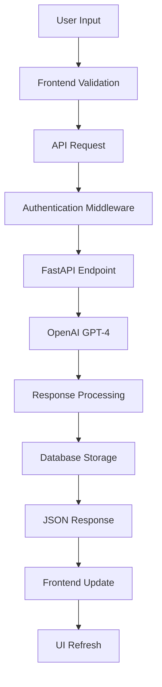

# 🩺 IsThisNormal - Aplicação de Consultas Médicas Pediátricas

> Uma aplicação web inteligente que conecta pais a um assistente médico especializado em pediatria, proporcionando respostas rápidas e confiáveis sobre a saúde das crianças.


## 📋 Índice

- [Sobre o Projeto](#-sobre-o-projeto)
- [Funcionalidades](#-funcionalidades)
- [Tecnologias](#-tecnologias)
- [Arquitetura](#-arquitetura)
- [Instalação](#-instalação)
- [Uso](#-uso)
- [API Reference](#-api-reference)
- [Screenshots](#-screenshots)
- [Contribuição](#-contribuição)
- [Licença](#-licença)

## 🎯 Sobre o Projeto

**IsThisNormal** é uma aplicação web moderna desenvolvida para ajudar pais e cuidadores a obterem orientações médicas confiáveis sobre questões relacionadas à saúde infantil. A aplicação utiliza inteligência artificial especializada em pediatria para fornecer respostas precisas e determinar quando é necessário procurar atendimento médico presencial.

### 🎨 Design Principles

- **User-Centric**: Interface intuitiva focada na experiência do usuário
- **Medical Safety**: Sistema de triagem automática para casos urgentes
- **Responsive Design**: Totalmente responsivo para todos os dispositivos
- **Performance First**: Carregamento rápido e otimizado

## ✨ Funcionalidades

### 🔐 Autenticação & Segurança
- Sistema de autenticação seguro com Supabase
- Gerenciamento de sessões com cookies httpOnly
- Proteção de rotas e middleware de autenticação
- Validação de dados em tempo real

### 🤖 Consultas Inteligentes
- **Assistente AI Especializado**: Pediatra virtual com décadas de experiência
- **Triagem Automática**: Determina automaticamente se é necessária consulta presencial
- **Respostas Estruturadas**: Formato JSON com resposta médica + recomendação
- **Histórico Completo**: Armazenamento de todas as consultas e trocas

### 💬 Interface de Chat
- **Chat em Tempo Real**: Interface similar ao ChatGPT para consultas
- **Perguntas de Acompanhamento**: Possibilidade de fazer perguntas adicionais
- **Loading States**: Feedback visual durante processamento
- **Exemplos Contextuais**: Sugestões de perguntas comuns

### 📊 Gestão de Consultas
- **Sidebar Dinâmica**: Histórico organizado de todas as consultas
- **Navegação Intuitiva**: Fácil acesso a consultas anteriores
- **Timestamps**: Controle temporal das consultas
- **Pesquisa Rápida**: Localização eficiente de consultas passadas

## 🛠 Tecnologias

### Frontend
```typescript
// Tech Stack Principal
- Nuxt.js 3.17.6          // Framework full-stack Vue.js
- Vue.js 3.5.17           // Framework reativo
- TypeScript              // Tipagem estática
- Tailwind CSS 4.1.11     // Styling utility-first
- Pinia 3.0.3             // Gerenciamento de estado
- VueUse                  // Composables utilitários
```

### Backend
```python
# API & Serviços
- FastAPI                 # Framework web assíncrono
- SQLAlchemy             # ORM para PostgreSQL
- OpenAI GPT-4.1         # Inteligência Artificial
- Supabase Auth          # Autenticação e autorização
- PostgreSQL             # Banco de dados relacional
- Pydantic               # Validação de dados
```

### DevOps & Tools
- **Vite**: Build tool e dev server
- **ESLint + Prettier**: Code quality e formatting
- **Git**: Controle de versão
- **Docker Ready**: Containerização preparada

## 🏗 Arquitetura

### Estrutura do Projeto
```
IsThisNormal/
├── backend/                 # API FastAPI
│   ├── routes/             # Endpoints da API
│   ├── models.py           # Modelos SQLAlchemy
│   ├── services.py         # Lógica de negócio + AI
│   ├── auth.py             # Autenticação
│   └── database.py         # Configuração DB
│
├── isthisnormal/           # Frontend Nuxt.js
│   ├── components/         # Componentes Vue
│   ├── pages/              # Rotas da aplicação
│   ├── stores/             # Pinia stores
│   ├── composables/        # Composables reutilizáveis
│   └── types/              # Definições TypeScript
│
└── README.md               # Documentação
```

### Fluxo de Dados


### Modelos de Dados
```typescript
// Consultation Model
interface Consultation {
  id: string
  question_text: string
  user_id: string
  created_at: string
  exchanges: Exchange[]
}

// Exchange Model
interface Exchange {
  id: string
  consultation_id: string
  question_text: string
  answer_text: string
  check_pediatrician: boolean
  created_at: string
}
```

## 🚀 Instalação

### Pré-requisitos
- Node.js 18+
- Python 3.8+
- PostgreSQL 13+
- OpenAI API Key
- Supabase Account

### 1. Clone o Repositório
```bash
git clone https://github.com/seu-usuario/IsThisNormal.git
cd IsThisNormal
```

### 2. Configuração do Backend
```bash
cd backend

# Criar ambiente virtual
python -m venv venv
source venv/bin/activate  # Linux/Mac
# venv\Scripts\activate   # Windows

# Instalar dependências
pip install -r requirements.txt

# Configurar variáveis de ambiente
cp .env.example .env
# Editar .env com suas credenciais
```

### 3. Configuração do Frontend
```bash
cd isthisnormal

# Instalar dependências
npm install

# Configurar variáveis de ambiente
cp .env.example .env
# Editar .env com suas configurações
```

### 4. Configuração do Banco de Dados
```bash
# No diretório backend
python -c "from database import engine, Base; Base.metadata.create_all(bind=engine)"
```

### 5. Execução em Desenvolvimento
```bash
# Terminal 1 - Backend
cd backend
uvicorn main:app --reload --port 8000

# Terminal 2 - Frontend
cd isthisnormal
npm run dev
```

A aplicação estará disponível em:
- Frontend: `http://localhost:3000`
- Backend API: `http://localhost:8000`
- Documentação API: `http://localhost:8000/docs`

## 📖 Uso

### 1. Registro e Login
1. Acesse `http://localhost:3000`
2. Clique em "Sign Up" para criar uma conta
3. Faça login com suas credenciais

### 2. Primeira Consulta
1. Na página inicial, digite uma pergunta sobre a saúde da criança
2. Clique no botão → para enviar
3. Aguarde a resposta do assistente médico
4. Se necessário, faça perguntas de acompanhamento

### 3. Histórico
1. Use a sidebar à esquerda para navegar pelo histórico
2. Clique em qualquer consulta para visualizar a conversa completa
3. Continue conversas anteriores a qualquer momento

## 🔌 API Reference

### Autenticação
```http
POST /api/auth/login
POST /api/auth/register
POST /api/auth/logout
GET  /api/auth/me
```

### Consultas
```http
GET    /api/consultations           # Lista consultas do usuário
POST   /api/consultations           # Cria nova consulta
GET    /api/consultations/{id}      # Busca consulta específica
POST   /api/consultations/{id}/exchanges  # Adiciona pergunta
```

### Exemplo de Request
```typescript
// Criar consulta
const response = await fetch('/api/consultations', {
  method: 'POST',
  headers: { 'Content-Type': 'application/json' },
  body: JSON.stringify({
    question_text: "Meu filho está com febre, é normal?"
  })
})
```

### Exemplo de Response
```json
{
  "id": "uuid-here",
  "question_text": "Meu filho está com febre, é normal?",
  "user_id": "user-uuid",
  "created_at": "2024-01-15T10:30:00Z",
  "exchanges": [
    {
      "id": "exchange-uuid",
      "question_text": "Meu filho está com febre, é normal?",
      "answer_text": "A febre em crianças pode ser...",
      "check_pediatrician": true,
      "created_at": "2024-01-15T10:30:05Z"
    }
  ]
}
```

## 📱 Screenshots

### 🏠 Página Inicial
Interface limpa e intuitiva para fazer perguntas sobre saúde infantil.

### 💬 Chat de Consulta
Sistema de chat em tempo real com o assistente médico especializado.

### 📋 Histórico de Consultas
Sidebar organizada com todas as consultas anteriores do usuário.

### ⚠️ Alerta Médico
Notificação automática quando consulta presencial é recomendada.

## 🎯 Funcionalidades Avançadas

### 🧠 Inteligência Artificial
- **Modelo**: OpenAI GPT-4.1 especializado em pediatria
- **Prompt Engineering**: Sistema especializado com décadas de experiência
- **Triagem Inteligente**: Análise automática de sinais de alarme
- **Respostas Estruturadas**: Formato JSON consistente

### 🔒 Segurança
- **Autenticação Segura**: Integração com Supabase Auth
- **Cookies HttpOnly**: Proteção contra XSS
- **Validação de Dados**: Pydantic + TypeScript
- **CORS Configurado**: Políticas de origem cruzada

### ⚡ Performance
- **SSR/SPA Híbrido**: Nuxt.js para otimização automática
- **Code Splitting**: Carregamento sob demanda
- **Caching**: Estratégias de cache inteligentes
- **Lazy Loading**: Componentes e rotas carregados conforme necessário

## 👨‍💻 Desenvolvimento

### Comandos Úteis
```bash
# Frontend
npm run dev          # Desenvolvimento
npm run build        # Build de produção
npm run generate     # Geração estática
npm run preview      # Preview do build

# Backend
uvicorn main:app --reload    # Desenvolvimento
python -m pytest            # Testes
black .                      # Formatação
flake8                       # Linting
```

### Estrutura de Componentes
```vue
<!-- Exemplo de Componente -->
<template>
  <div class="consultation-card">
    <header>{{ consultation.question_text }}</header>
    <div v-for="exchange in consultation.exchanges">
      <ExchangeCard :exchange="exchange" />
    </div>
  </div>
</template>

<script setup lang="ts">
// Composition API com TypeScript
</script>
```

### Padrões de Código
- **Composition API**: Vue 3 com setup script
- **TypeScript First**: Tipagem em todo o projeto
- **Pinia Stores**: Gerenciamento de estado reativo
- **Async/Await**: Operações assíncronas consistentes

## 🚀 Deploy

### Frontend (Vercel/Netlify)
```bash
npm run build
npm run generate  # Para hosting estático
```

### Backend (Railway/Heroku)
```bash
# Dockerfile incluído
docker build -t isthisnormal-api .
docker run -p 8000:8000 isthisnormal-api
```

### Variáveis de Ambiente
```env
# Backend
DATABASE_URL=postgresql://...
OPENAI_API_KEY=sk-...
SUPABASE_URL=https://...
SUPABASE_ANON_KEY=eyJ...

# Frontend
NUXT_PUBLIC_API_BASE_URL=https://api.isthisnormal.com
```

## 🤝 Contribuição

Contribuições são bem-vindas! Por favor, leia as [diretrizes de contribuição](CONTRIBUTING.md).

1. Fork o projeto
2. Crie uma branch para sua feature (`git checkout -b feature/AmazingFeature`)
3. Commit suas mudanças (`git commit -m 'Add some AmazingFeature'`)
4. Push para a branch (`git push origin feature/AmazingFeature`)
5. Abra um Pull Request

## 👨‍💻 Autor

**Seu Nome**
- GitHub: [@seu-usuario](https://github.com/seu-usuario)
- LinkedIn: [seu-perfil](https://linkedin.com/in/seu-perfil)
- Email: seu.email@example.com

## 📄 Licença

Este projeto está sob a licença MIT. Veja o arquivo [LICENSE](LICENSE) para mais detalhes.

---

<div align="center">
  <p>Feito com ❤️ para ajudar pais e cuidadores</p>
  <p>
    <strong>IsThisNormal</strong> - Quando a saúde das crianças importa
  </p>
</div> 